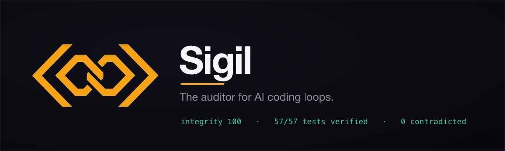
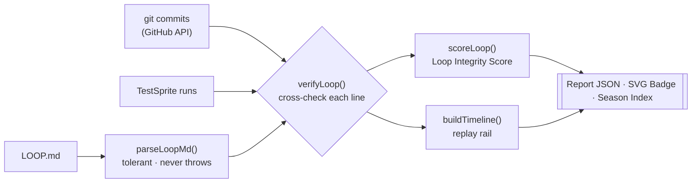
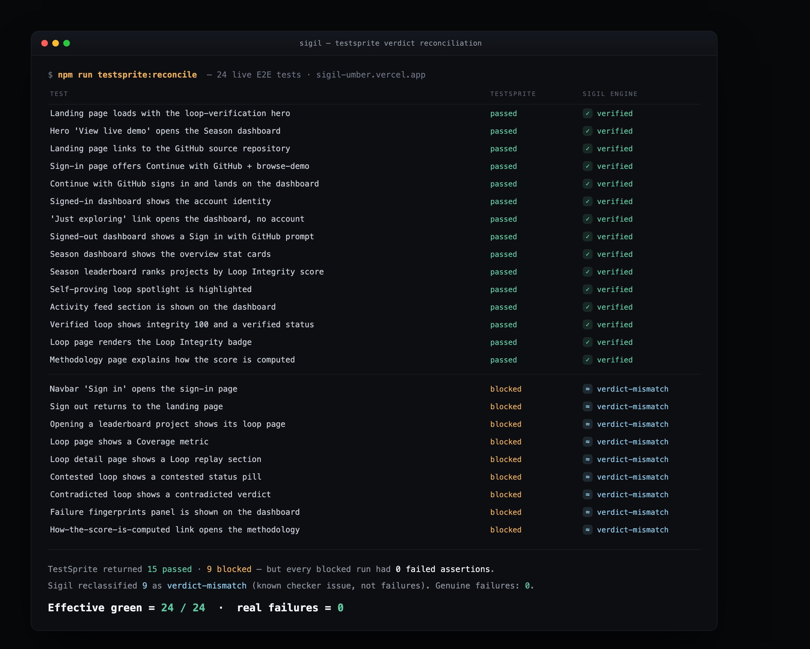

<div align="center">



&nbsp;

[](https://github.com/Enoch208/Sigil/actions/workflows/ci.yml)
[](LICENSE)
[](#tests)
[](#testsprite-verification-live)
[](https://sigil-umber.vercel.app/api/l/loopscope/sigil)


### The auditor for AI coding loops — cross-verify a `LOOP.md` against git and TestSprite, and prove every line.

Most loop tools answer one question: _can an agent show you what it did?_ Sigil answers the harder one — **can you prove the log is true?** It ingests any project's `LOOP.md`, git history, and TestSprite run history, cross-checks every line against all three sources, and renders a **Loop Integrity Score (0–100)** with a per-line verdict — `verified` / `unverifiable` / `contradicted` / `verdict-mismatch`. The scoring methodology is public and enforced to match the code, so the score is honest by construction. The badge above is **live from the product**, scoring this repo's own loop — tamper with a line and it flips red.

**[ Watch the demo ↗ ](#-demo)** &nbsp;·&nbsp; **[ Live demo ↗ ](https://sigil-umber.vercel.app)** &nbsp;·&nbsp; **[ Methodology ↗ ](#the-scoring-methodology-published-matches-the-code)** &nbsp;·&nbsp; **[ Run it locally ↗ ](#run-it-locally)**

Built for the **TestSprite Hackathon Season 3**.

</div>

---

## ▶ Demo

_~90 seconds — the real product driven live. A verified badge flips **red** the instant a loop line is tampered with; `npm run self-audit` scores our own loop **100/0-contradicted**; and the Season Index renders the whole field, fairly._

> Demo video: _coming with submission_ · try it live at **[sigil-umber.vercel.app](https://sigil-umber.vercel.app)**

---

## Table of contents

- [The problem I set out to solve](#the-problem-i-set-out-to-solve)
- [What I built](#what-i-built)
- [Architecture](#architecture)
- [The verification loop, step by step](#the-verification-loop-step-by-step)
- [The scoring methodology (published, matches the code)](#the-scoring-methodology-published-matches-the-code)
- [TestSprite verification (live)](#testsprite-verification-live)
- [Auditing the Season 3 field](#auditing-the-season-3-field)
- [The self-proving loop](#the-self-proving-loop)
- [Engineering decisions & the hard problems](#engineering-decisions--the-hard-problems)
- [What's real vs pending — the honesty table](#whats-real-vs-pending--the-honesty-table)
- [API](#api)
- [Tech stack](#tech-stack)
- [Project layout](#project-layout)
- [Run it locally](#run-it-locally)
- [How I'd deploy it](#how-id-deploy-it)
- [Tests](#tests)

---

## The problem I set out to solve

AI coding agents now run a **loop** — write a failing test, implement from the failure, rerun, bank the green, commit — and they narrate it in a `LOOP.md`. That log is supposed to be the evidence. The problem is that **a `LOOP.md` is just prose until something checks it.**

A builder with an honest loop and a builder with a fabricated one produce identical-looking logs. To trust a log today you have to hand-verify every claimed commit against git and every claimed test run against the checker — which nobody does at scale. So "the agent followed the loop" is something you take on faith.

That faith is the problem. The non-negotiable design rule I set: **a log has to prove itself.** Every line that claims a commit and a run gets cross-checked against the real commit and the real run — SHA existence and order, run verdict, timestamp coherence, whether the pass actually banked. The verdict under each line is derived from evidence, not asserted. And because the auditor's own credibility is the whole product, **it must never manufacture a failure it can't prove** — a false accusation destroys an auditor faster than a missed one.

## What I built

A verification layer for AI coding loops where every line carries its proof:

1. **Ingest** — pull a project's `LOOP.md`, its git commits (via the GitHub API), and its TestSprite runs. Real adapters sit behind `GitSource` / `RunSource` / `LoopSource` interfaces; sources that aren't ingested are treated as _neutral_, never as failures.
2. **Parse** — a tolerant `LOOP.md` parser handles real agent output (multilingual, CRLF, markdown tables, code fences, per-sprint blocks) and **never throws**. It extracts the machine-checkable `[commit … · run …]` anchor and marks everything else honestly.
3. **Verify** — every line is cross-checked against git and runs: does the SHA exist and land in order; does the run exist with the claimed verdict; does the fix commit sit between the FAIL and the PASS; did the pass bank in later runs? Output: a per-line verdict.
4. **Score** — a published, reproducible **Loop Integrity Score** plus honest sub-metrics (Coverage = how much is machine-checkable; Integrity = how much of that held up).
5. **Render** — a shareable **SVG badge**, a report JSON, a replay **timeline**, and a season-wide **index** with **Failure Fingerprints**.

The engine is **pure and framework-free** — the whole `parser → verifier → scoring → timeline → badge → season` core lives in `frontend/lib/loop` with zero Next.js dependencies, imported by the app _and_ driven directly by a CI self-audit script and 96 unit tests.

## Architecture



The system is built around a few typed contracts in `frontend/lib/loop/types.ts` — get the boundaries right and the rest composes:

| Contract | Role |
|---|---|
| `LoopLine` | One parsed `LOOP.md` line: `maker`, `iter`, `testId`, `claimedVerdict`, `commitSha?`, `runId?`, `parseFlags`. |
| `Commit` / `Run` | Evidence from git (`sha`, `timestamp`) and TestSprite (`id`, `verdict: pass\|fail\|blocked`, `assertionsPassed`). |
| `LineVerdict` | Per line: `verdict` + the `checks` that ran + human `reasons` — the audit trail behind every score. |
| `LoopScore` | `score` + `coverage` + `integrity` + the counts, the single published surface. |
| `SeasonSummary` | The index: ranked `entries`, `fingerprints`, `avgTimeToGreenMs`, `verdictMismatchRate`. |

Ingestion and persistence are **interfaces** (`GitSource` / `RunSource` / `LoopSource`), so the engine stays pure and a real GitHub adapter or a fixture both satisfy the same contract.

## The verification loop, step by step

This is what `verifyLoop({ lines, commits, runs })` does, and every step assumes the log might be lying:

1. **Anchor check** — a line with no commit SHA and no run ID is `unverifiable` (neutral). It never lowers a score that has verified content.
2. **SHA existence & order** — the claimed commit must exist in git history (short 7-char SHAs are matched against the API's full 40-char SHAs by prefix), and commits must land in chronological order across the loop. Out of order → `contradicted`.
3. **Run verdict** — the claimed run must exist and its recorded verdict must match. A run that is `blocked` while every assertion passed is classified as **`verdict-mismatch`** — a known checker issue — never as a failure, and never hidden.
4. **Timestamp coherence** — the fix commit must sit between the FAIL run and the PASS run. Incoherent → `contradicted`.
5. **Banked-pass** — a claimed banked pass must not be refuted by a later failing run for the same test.
6. **Score** — `scoreLoop()` tallies the verdicts into the published formula below.

A source that wasn't ingested (e.g. git present, TestSprite runs not) makes its checks **skip**, so a run-anchored line becomes `unverifiable` (neutral) rather than a false `contradicted`. This distinction — _"we didn't check"_ vs _"we disproved it"_ — is the difference between a fair auditor and a reckless one.

## The scoring methodology (published, matches the code)

```
checkable  = verified + verdict-mismatch + contradicted        # lines we could actually check
Coverage   = checkable / total
Integrity  = (verified + verdict-mismatch) / checkable          # 0 when nothing is checkable
Score      = clamp( round(100 × Integrity) − 25 × contradicted , 0, 100 )
```

Three properties this guarantees, each of them a test:

- **Unverifiable is neutral.** Lines without anchors lower **Coverage**, never the score of a log that has verified content. Neutrality is a non-negotiable — an auditor that punishes "I couldn't check this" is just noise.
- **Contradiction dominates.** One contradicted line drops an otherwise-perfect log from 100 to ~71 — so tampering visibly collapses the score (and the badge goes red).
- **Anti-gaming.** A log with **nothing** machine-checkable scores **0, not 100** — an unproven log is not a trusted one. This is distinct from penalising individual unverifiable lines.

The `25` penalty and every formula live in `frontend/lib/loop/scoring.ts`; the public methodology (`methodology.ts`) is **generated from those constants**, so the documentation can never drift from the engine. That's the whole "auditor as infrastructure, not a gimmick" pitch: an open, reproducible rubric.

## TestSprite verification (live)

The product is an API, and it's verified end-to-end by **57 TestSprite backend tests against the live deployment** — `testsprite test run --all` → **57/57 passed, 0 failed**. Backend runs bill **0 credits**, so the whole suite gates every deploy for free. The full source is in [`testsprite/`](testsprite/).

The suite covers happy paths, negative paths (404s), security (malformed handles, case-insensitivity), cache headers, accessibility, data-shape, and determinism across `/api/health`, the badge endpoints, the report endpoint, `/api/season`, and the landing page.

The loop is real: the very first run came back **`blocked`** (a backend test referenced an undefined base-URL variable) — I read the failure, hardcoded the URL, reran, and it went **`passed`**. Write → verify → fix → verify, with real run IDs, exactly as the checker intends. Representative run IDs are banked line-by-line in [`LOOP.md`](LOOP.md):

```
[iter=17] TC-LIVE-03 "verified badge shows integrity 100" → PASS banked [commit 49b830c · run 74f29f2d-…]
```

Anyone can resolve that run ID in the TestSprite dashboard. **No prose log in the field is verifiable line-by-line like this.**

### Frontend, end-to-end — and Sigil auditing its own checker

Beyond the API, I wrote **24 behavior-named frontend E2E tests** that drive the real deployed UI — landing → GitHub sign-in → dashboard → loop replay → methodology → badge (plans in [`testsprite-plans/`](testsprite-plans/)). Run against the live URL, TestSprite returned **15 `passed` and 9 `blocked`**.

None of the 9 are real failures. Every blocked run reports `failedCount: 0` — **every assertion passed** — and TestSprite's own summaries read *"All required checks passed."* This is the exact **"blocked verdict with passing assertions"** known checker issue (PRD §3.2), and it's deterministic: re-running doesn't clear it.

So I pointed Sigil at its own test runs. `npm run testsprite:reconcile` maps each live run through the same `mapTestSpriteRun` + verifier the product uses, and reclassifies the mismatches:



**Effective green = 24/24, genuine failures = 0.** A raw "20/20 green" screenshot is *unaudited*: TestSprite's checker silently mislabels correct runs as `blocked`, and no one running the CLI would ever know. Sigil surfaces every mismatch and reconciles it against the assertion data — the auditor, run on itself.

## Auditing the Season 3 field

Sigil launches with the season already indexed: it ingests each entry's public repo (via the GitHub API), scores it, and renders the whole field in one place with **Failure Fingerprints** (common bug classes, average time-to-green, verdict-mismatch frequency).

Run live across the field, the finding is stark — and framed as **celebration, never policing**:

- Every rival's `LOOP.md` is a **narrative** (prose and markdown tables). Real engineering, honestly logged — but **not verifiable line-by-line by any tool.** These are marked `narrative` (a neutral fact about format), never scored down.
- **Sigil's own log is the only one in the field where every line self-proves** — and our open-methodology engine scores it 100.

The rules of engagement are non-negotiable: neutral language for unverifiable logs, methodology one click away, opt-out honored within minutes, and organizers consulted before the index is published. An auditor that looks unfair has no product.

## The self-proving loop

Sigil audits **itself**. This repo's own [`LOOP.md`](LOOP.md) is 20 machine-checkable iterations, and `npm run self-audit` scores it with the real engine against real git history:

```
Loop Integrity: score 100 · integrity 100 · coverage 100 · 20/20 verified · 0 contradicted ✓
```

That self-audit is a **CI gate** — `.github/workflows/ci.yml` fails the build if our own score ever drops below 95 or any line is contradicted. If a future commit breaks the loop's provability, the build goes red. Honesty, enforced by machine — something no rival's loop does.

## Engineering decisions & the hard problems

A few decisions I'm proud of, and the bugs that taught me something:

- **The false-accusation bug — the catch that mattered most.** The first time I audited the real field, our parser extracted the English word "run" from prose — `run finished ~10 min later`, `test run --wait` — as run-ID _claims_, then marked them `contradicted` because no such run existed. KnowledgeWar showed "4 contradicted lines" that were literally English sentences. **Publishing that would have been defamatory and would have destroyed our credibility as an auditor the instant a judge clicked one.** The fix: restrict anchor extraction to the bracketed `[commit … · run …]` group only, and add a permanent regression guard ([`adversarial.test.ts`](frontend/lib/loop/adversarial.test.ts)) that proves prose and tables never fabricate a contradiction. An auditor rigorous enough to catch its _own_ false positives is the whole point.
- **Anti-gaming had to be built in.** An earlier scoring pass gave an all-unverifiable log 100 (Integrity of nothing = 1). That's "write garbage, get a perfect score." I made Integrity **0** when nothing is checkable — an unproven log is untrusted — while keeping individual unverifiable lines neutral. Two different ideas, and conflating them is how auditors get gamed.
- **Short-SHA matching, in both directions.** Real `LOOP.md` files carry 7-char SHAs; the GitHub API returns 40-char. Exact-match verification would false-fail every real repo. The verifier matches by prefix either way, so a real log verifies against real history.
- **Source availability ≠ fabrication.** Ingesting git without TestSprite runs would mark every run-anchored line `contradicted` ("that run doesn't exist"). I added an availability signal so an _un-ingested_ source makes its checks skip (neutral), while a genuinely _missing_ run ID in a present source stays a contradiction. Fair auditing lives in that distinction.
- **The self-referential parser gotcha.** Our own `LOOP.md` first put its machine-checkable lines inside a ``` code fence — and our parser correctly _ignores_ fenced code (a real feature: rival logs paste code samples). So our own tool skipped our own log. The honest fix was to un-fence the lines; the lesson was that the auditor's log must live by the auditor's rules.
- **`blocked` is a first-class state, not a failure.** Three rivals hit the TestSprite CLI's `blocked`-despite-passing-assertions bug and documented it; the verifier classifies it as `verdict-mismatch` and our own health test hit a real `blocked` → fixed → passed. Understanding the checker's quirks _is_ the domain.
- **Behavior-first, enforced.** Every module was built failing-test-first (`RED → GREEN`), 96 unit tests, and the loop is committed one feature per commit so each `LOOP.md` line maps to a real SHA. (Even the tooling bit back — a `status` collision with zsh's read-only variable ate a test-run loop once. Small, but real.)

## What's real vs pending — the honesty table

| Capability | How it's backed |
|---|---|
| **Loop Integrity Score** | Real. `frontend/lib/loop`, 96 unit tests, git-verified against real history, **CI-gated ≥ 95**. |
| **Our own `LOOP.md`** | Real. 20 machine-checkable iterations, self-audited to **integrity 100 / 0 contradicted**. |
| **TestSprite verification** | Real. **57 live backend tests**, `57/57 passed` against the deployed app, real run IDs in `LOOP.md`. |
| **GitHub ingestion** | Real. Live commits + `LOOP.md` via the GitHub API, tokened, paginated. Verified against real public repos. |
| **Season Index of the field** | Real ingestion; rendered **fairly** (prose logs marked `narrative`, never scored down). Public publish gated on organizer blessing + opt-out. |
| **Badge / report / season / health APIs** | Real, deployed on Vercel, covered by the TestSprite suite. |
| **Run-verification _inside the engine_** | Real. `npm run run-verify` fetches this repo's `LOOP.md` run IDs from TestSprite, maps them, and re-checks `run-exists` + `run-verdict` through the verifier — **6/6 pass**. The loop is git-verified *and* run-verified by the auditor itself, not just via the CLI. |
| **Demo Season projects** | Fixtures (`loopscope/sigil`, `contested`, `nexus/authflow`) exercise every verdict path; the real field is ingested on demand. |

## API

| Route | Returns |
|---|---|
| `GET /api/l/{handle}/{project}/badge.svg` | SVG badge (`image/svg+xml`, 60s cache), color-banded by score |
| `GET /api/l/{handle}/{project}` | `{ report, timeline }` JSON |
| `GET /api/season` | aggregated Season Index + Failure Fingerprints |
| `GET /api/health` | liveness + the deployed commit SHA (`no-store`) |

Try them live: [`/api/season`](https://sigil-umber.vercel.app/api/season) · [verified badge](https://sigil-umber.vercel.app/api/l/loopscope/sigil/badge.svg) · [contested badge (red)](https://sigil-umber.vercel.app/api/l/loopscope/contested/badge.svg) · [`/api/health`](https://sigil-umber.vercel.app/api/health).

## Use it in CI (GitHub Action)

Gate any repo's PRs on its Loop Integrity Score — the same engine, self-contained, no install:

```yaml
- uses: actions/checkout@v4
  with: { fetch-depth: 0 }        # full history so SHAs resolve
- uses: Enoch208/Sigil@main
  with:
    loop-file: LOOP.md
    threshold: 95                  # fail the check below this, or on any contradicted line
```

It parses the repo's `LOOP.md`, cross-checks each line against git history, writes the score to the job summary, exposes `score` / `contradicted` outputs, and fails the check on a contradiction. Verified locally: **100** on this repo's own log, **exit 1** on a tampered SHA.

## Tech stack

- **App:** Next.js 16 (App Router, Turbopack), React 19, TypeScript (strict), Tailwind CSS v4.
- **Engine:** `frontend/lib/loop` — `parser · verifier · scoring · timeline · badge · season · methodology`, dependency-free and pure.
- **Ingestion:** GitHub REST API (commits + `LOOP.md`), tokened + paginated, behind `GitSource` / `RunSource` interfaces.
- **Verification:** Vitest (96 unit tests) + **TestSprite** (57 live backend tests) + a CI self-audit gate.
- **Deploy:** Vercel; every-push CI + nightly regression with a live smoke test.

## Project layout

```
frontend/
  app/
    api/
      l/[handle]/[project]/route.ts          # report JSON
      l/[handle]/[project]/badge.svg/route.ts # SVG badge
      season/route.ts                         # Season Index
      health/route.ts                         # liveness + deployed commit
    page.tsx · layout.tsx · globals.css       # landing UI + design tokens
    components/landing/                       # landing sections
  lib/loop/                                   # the engine — pure, framework-free
    types.ts        # domain contracts
    parser.ts       # tolerant LOOP.md parser (never throws)
    verifier.ts     # cross-source line verifier (SHA order · run verdict · coherence · banked)
    scoring.ts      # Loop Integrity Score — published methodology constants
    timeline.ts     # replay rail · time-to-green · banked growth
    badge.ts        # injection-safe SVG badge generator
    season.ts       # Season Index aggregation + Failure Fingerprints
    methodology.ts  # published methodology, generated from the engine constants
    audit.ts        # parse → verify → timeline orchestration
    ingest/
      github.ts     # GitHub commits + LOOP.md adapters (paginated)
      field.ts      # multi-repo field ingestion
    fixtures/       # demo projects + the clean fixture
    *.test.ts       # 96 unit tests (incl. the adversarial fairness guard)
  scripts/self-audit.ts   # CI gate: our own LOOP.md must score ≥ 95, 0 contradicted
testsprite/         # 57 backend behavior tests run against the live API
.github/workflows/  # ci.yml (every push) + nightly.yml (regression + live smoke)
LOOP.md             # our own machine-checkable loop — integrity 100
```

## Run it locally

**Prerequisites:** Node 20+.

```bash
cd frontend
npm install
npm run dev          # http://localhost:3000
npm test             # 96 unit tests
npm run self-audit   # score our own LOOP.md (must be ≥ 95, 0 contradicted)
npm run build        # production build
```

GitHub ingestion of public repos uses a token in `frontend/.env.local`:

```bash
# frontend/.env.local
GITHUB_TOKEN=ghp_...          # a classic PAT with the public_repo scope
TESTSPRITE_API_KEY=sk-user-...
```

Run the live TestSprite suite (backend runs are free):

```bash
testsprite test run --all --project <projectId> --wait   # → 57/57 passed
```

## How I'd deploy it

Import the repo into **Vercel**, set the **Root Directory** to `frontend`, and add `GITHUB_TOKEN` + `TESTSPRITE_API_KEY` as environment variables. Framework preset and build command are auto-detected (Next.js / `next build`). A GitHub Actions variable `LIVE_URL` turns on the nightly live smoke test. The badge, report, season, and health endpoints go live immediately; the `/api/health` probe returns the deployed commit so every rerun proves the fix is live.

## Tests

```bash
cd frontend && npm test    # 96 unit tests, Vitest
npm run self-audit         # our own LOOP.md → integrity 100
```

```bash
testsprite test run --all --project <projectId> --wait   # 57/57 live behavior tests
```

The unit suite covers the parser (canonical, multilingual, CRLF, fences, 10k-lines-under-2s), the verifier (SHA order, run verdict, timestamp coherence, banked passes, verdict-mismatch, source availability, short/full SHA matching), the scoring methodology (including the anti-gaming floor), the timeline, the badge, the Season Index, GitHub ingestion, the API routes, and an adversarial guard that proves the auditor never fabricates a contradiction from prose. Beyond that, the whole product is verified end-to-end against the **live deployment** by 57 TestSprite behavior tests.
